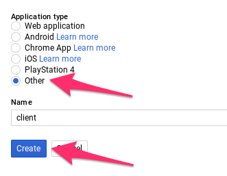

- Navigate to Google's [Cloud Platform](https://console.cloud.google.com/home/dashboard?project=ayi-led){:target="_blank"} and ensure you are logged into you Google Account.

- You need to create a new project to get started. If you have no existing projects, click on the **Create** button. If you  do have existing projects, you can click on the **Select a project** drop-down menu.

	

- If you clicked the drop-down menu, you can click on the **+** symbol to create a new project.

	

- Give your project a name (it doesn't matter what you call it), and then click on **Create**.

	

- Check that your project appears in the drop-down menu, as shown below.

	

- If it doesn't, click on the drop down and then select **All** from the popup to find and select your project.

	

- Now you need to click on the **API Manager**.

	

- Then click on the **ENABLE API** link.

	

- Use the search box to find the **Google Assistant API**.

	

- Once you have selected the API, click on the **ENABLE** link.

	

- Now, click on the **Credentials** link in the side bar to create some new credentials.

	

- You can create your credentials by selecting **OAuth client ID** from the drop-down menu.

	

- You're now going to need to configure the consent screen.

	

- You can type your email address and project name into the boxes and leave the other fields blank if you like. Then click **Save**.

	

- On the main screen, you can now choose **Other** as your application type and give your application any name you choose. Then click **Create**.

	

- You should be presented with your **client ID** and **client secret**. You can just click on **OK** though, as you're going to just download a **json** file containing these details.

	

- Click on the **Download** icon to download your secrets to your computer, and you should be finished.

	
